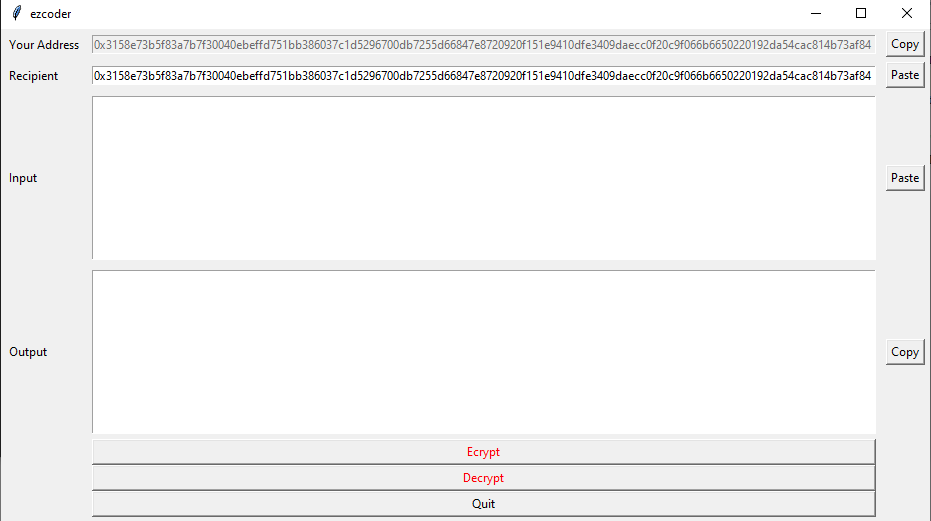

# ezcoder
Message encryptor and decryptor based on an Ethereum implementation of ECIES with a GUI.

On starting, a keypair is generated and saved in keys.dat file. It should be possible to replace keys with your Ethereum wallet's keys, but I have not tested that.

* To encrypt a message, insert recipient's public key to the "recipient" field, enter "input", click "encrypt", then send them the encrypted message.
* To decrypt a message, just insert the encrypted message into the "input" field and click "decrypt". You need to be the intended recipient based on your address.

### Preview:

